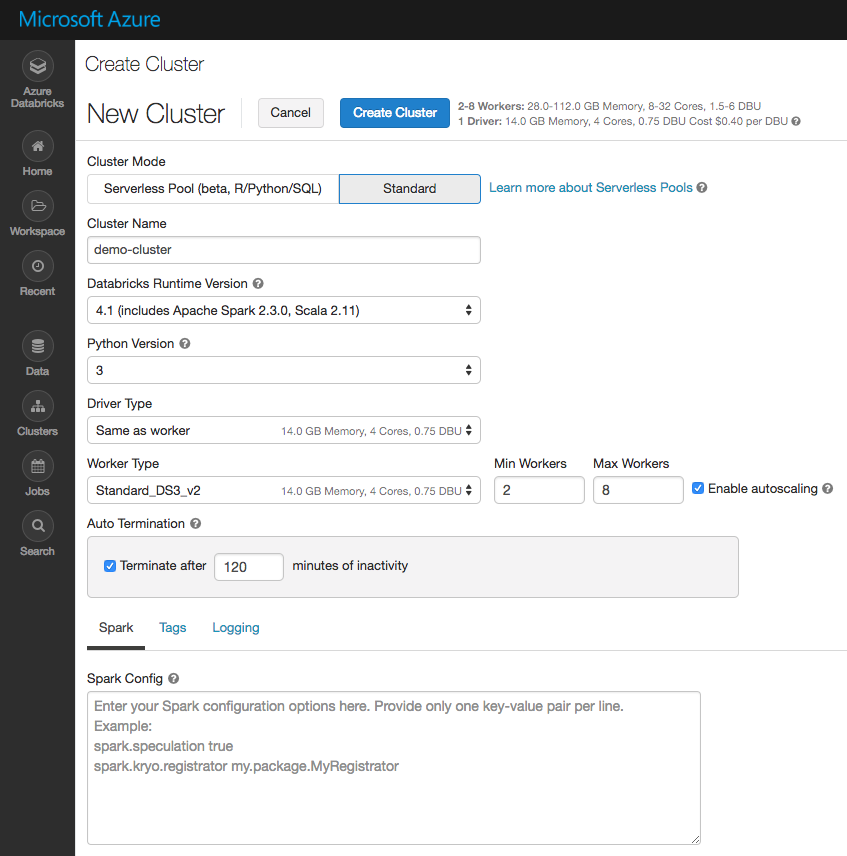
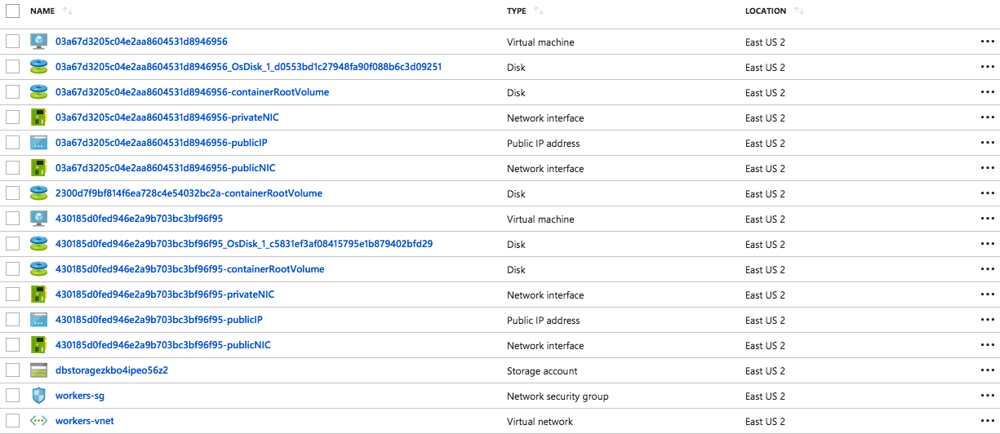
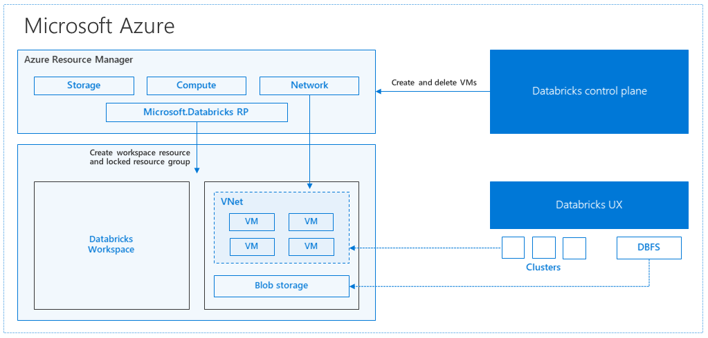
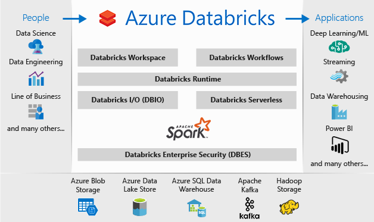

# Azure Databricks architecture

To gain a better understanding of how to develop with Azure Databricks, it is important to understand the underlying architecture. We will look at two aspects of the Databricks architecture: the Azure Databricks service and Apache Spark clusters.

## High-level overview

From a high level, the Azure Databricks service launches and manages Apache Spark clusters within your Azure subscription. Apache Spark clusters are groups of computers that are treated as a single computer and handle the execution of commands issues from notebooks. Using a master-worker type architecture, clusters allow processing of data to be parallelized across many computers to improve scale and performance. They consist of a Spark Driver (master) and worker nodes. The `driver` node sends work to the `worker` nodes and instructs them to pull data from a specified data source.

In Databricks, the notebook interface is the driver program. This driver program contains the main loop for the program and creates distributed datasets on the cluster, then applies operations (transformations & actions) to those datasets. Driver programs access Apache Spark through a `SparkSession` object regardless of deployment location.

Microsoft Azure manages the cluster, and auto-scales it as needed based on your usage and the setting used when configuring the cluster. Auto-termination can also be enabled, which allows Azure to terminate the cluster after a specified number of minutes of inactivity.

## Under the covers

Now let's take a deeper look under the covers. When you create an Azure Databricks service, a "Databricks appliance" is deployed as an Azure resource in your subscription. At the time of cluster creation, you specify the types and sizes of the virtual machines (VMs) to use for both the Driver and Worker nodes, but Azure Databricks manages all other aspects of the cluster.

> You also have the option of using a Serverless Pool (beta). A Serverless Pool is self-managed pool of cloud resources that is auto-configured for interactive Spark workloads. You provide the minimum and maximum number of workers and the worker type, and Azure Databricks provisions the compute and local storage based on your usage. For more information on creating and configuring clusters, see the [Configuring the Cluster](../configuration/clusters.md).

The "Databricks appliance" is deployed into Azure as a managed resource group within your subscription. This resource group contains the Driver and Worker VMs, along with other required resources, including a virtual network, a security group, and a storage account. All metadata for your cluster, such as scheduled jobs, is stored in an Azure Database with geo-replication for fault tolerance.

Internally, Azure Kubernetes Service (AKS) is used to run the Azure Databricks control-plane and data-planes via containers running on the latest generation of Azure hardware (Dv3 VMs), with NvMe SSDs capable of blazing 100us latency on IO. These make Databricks I/O performance even better. In addition, accelerated networking provides the fastest virtualized network infrastructure in the cloud. Azure Databricks utilizes this to further improve Spark performance. Once the services within this managed resource group are ready, you will be able to manage the Databricks cluster through the Azure Databricks UI and through features such as auto-scaling and auto-termination.

## Total Azure integration

The provide the best platform for data engineers, data scientists, and business users, Azure Databricks is natively integrated with Microsoft Azure, providing a “first party” Microsoft service. Microsoft is working to integrate Azure Databricks closely with all features of the Azure platform. Below is a list of some of the integrations completed so far:

- **VM types**: All existing VMs can be used for clusters, including F-series for machine learning scenarios, M-series for massive memory scenarios, and D-series for general purpose.
- **Security and Privacy**: Ownership and control of data is with the customer, and Microsoft aims for Azure Databricks to adhere to all the compliance certifications that the rest of Azure provides.
- **Flexibility in network topology**: Azure Databricks supports deployments into virtual networks (VNETs), which can control which sources and sinks can be accessed and how they are accessed.
- **Storage**: Azure Storage and Data Lake Store services are exposed to Databricks users via Databricks File System (DBFS) to provide caching and optimized analysis over existing data.
- **Orchestration**: ETL/ELT workflows (including analytics workloads in Azure Databricks) can be operationalized using Azure Data Factory pipelines.
- **Power BI**: Power BI can be connected directly to Databricks clusters using JDBC in order to query data interactively at massive scale using familiar tools.
- **Azure Active Directory**: Azure Databricks workspaces deploy into customer subscriptions, so naturally AAD can be used to control access to sources, results, and jobs.
- **Data stores**: Azure Databricks easily and efficiently uploads results into Azure SQL Data Warehouse, Azure SQL Database, and Azure CosmosDB for further analysis and real-time serving, making it simple to build end-to-end data architectures on Azure.

For developers, this design provides three things. First, it enables easy connection to any storage resources in their account, such as an existing Blob storage or Data Lake Store. Second, they are able to take advantage of deep integrations with other Azure services to quickly build data applications. Third, Databricks is managed centrally from the Azure control center, requiring no additional setup, which allows developers to focus on core business value, not infrastructure management.

## Next Steps

Read next: [The Databricks workspace](../workspace/workspace-overview.md)