# Operationalization with Azure Data Factory

Today’s business managers depend heavily on reliable data integration systems that run complex ETL/ELT workflows (extract, transform/load and load/transform data). These workflows allow businesses to ingest data in various forms and shapes from different on-premises/cloud data sources; transform/shape the data and gain actionable insights into data to make important business decisions.

To accommodate this, Azure Databricks provides support for ETL/ELT with [Azure Data Factory](https://azure.microsoft.com/services/data-factory/) (ADF).

## Why use Azure Data Factory with Azure Databricks

Azure Databricks provides several ways to execute notebooks on a scheduled basis, including Azure Data Factory (ADF) and [Jobs](https://docs.databricks.com/user-guide/jobs.html), so a natural question is why not just schedule Jobs in Azure Databricks.

Jobs work best if you are staying within the Databricks workspace, and have the resources you need there. Or, if the files you need are already in an accessible Azure storage location, and you will be working with it only in Azure Databricks.

Where ADF provides the most value is in its ability to quickly and easily create pipelines that can chain together multiple activities and data transformations, and pull data from multiple sources. For example, you could set up a pipeline to operationalize a trained ML model against new data you receive from an external source, and write the summarized output to an Azure SQL Database for further analysis. With ADF, you can copy data receive on-premises, using a Copy activity, to an Azure Storage account or Data Lake Store. The completion of the Copy activity would then trigger a Databricks Notebook activity, which would execute a notebook to run the data in the files through your trained ML model, and output the data with the associated predictions from your ML model to your storage location. A second copy activity could then be used to copy the scored data into an Azure SQL Database table.

## Transform data by running a Databricks notebook

The activity with ADF specific to Azure Databricks is the Databricks Notebook activity. The Azure Databricks Notebook activity in an ADF pipeline runs a Databricks notebook in a specified cluster within your Azure Databricks workspace. This is a data transformation activity, which can be used to transform and processes raw data into predictions and insights. Transformation activities require a compute environment to  execute, such as Azure Databricks cluster or an Azure Batch. By chaining data transformation activities with another activity, such as a copy activity, you can leverage the power of ADF, and build full pipelines to process your data from multiple sources. You also have the ability to pass Azure Data Factory parameters to the Databricks notebook during execution, providing flexibility for data engineers and business users with access to trigger the pipeline.

### The Databricks Notebook activity

The Databricks Notebook activity is available in ADF v2. You can add the activity to a pipeline using the user interface (UI), but behind the scenes, it is stored as JSON, and understanding this JSON is important if you want to quickly edit your activities (and pipelines), or need to troubleshoot issues.

Below is a sample JSON definition of a Databricks Notebook activity:

```json
{
    "activity": {
        "name": "DemoNotebook",
        "description": "MyActivity description",
        "type": "DatabricksNotebook",
        "linkedServiceName": {
            "referenceName": "AzureDatabricks",
            "type": "LinkedServiceReference"
        },
        "typeProperties": {
            "notebookPath": "/Users/user@example.com/Databricks-ADF-demo",
            "baseParameters": {
                "inputpath": "input/folder1/",
                "outputpath": "output/"
            }
        }
    }
}
```

To understand what the JSON represents, let's take a quick look at the properties which will drive the notebook and its parameters. Properties like name and description are self-explanatory, so we will only cover the properties listed under `typeProperties`.

- **notebookPath**: This property specifies the path within Databricks File System (DBFS) where your notebook is located. At this time, the full path is required, as relative paths are not yet supported.
- **baseParameters**: This is how parameter values are passed into a Databricks notebook. `baseParameters` is an array of key-value pairs, which can be used for each activity run. If the notebook takes a parameter that is not specified in `baseParameters`, the default value from the notebook will be used.
  - key: `STRING` - Named parameter, can be passed to `dbutils.widgets.get()` to retrieve the corresponding value.
  - value: `STRING` - Value of named parameter, returned by calls to `dbutils.widgets.get()` in notebooks.

For more detailed information about all the properties available in ADF for a Databricks Notebook activity, click [here](https://docs.microsoft.com/azure/data-factory/transform-data-databricks-notebook).

And for reference, here is the JSON for a sample Azure Databricks Linked Service. This will not usually be something you will edit after creation, as the Linked Service provides the details of the connection to your Azure Databricks cluster.

```json
{
    "name": "AzureDatabricks",
    "type": "Microsoft.DataFactory/factories/linkedservices",
    "properties": {
        "type": "AzureDatabricks",
        "typeProperties": {
            "domain": "https://eastus2.azuredatabricks.net",
            "existingClusterId": "0000-000000-xxxx00",
            "encryptedCredential": "ew0KICAiVmVyc2lvbiI6ICIyMDE3LTExLTMwIiwNCiAgIlByb3RlY3Rpb25Nb2RlIjogIktleSIsDQogICJTZWNyZXRDb250ZW50VHlwZSI6ICJQbGFpbnRleHQiLA0KICAiQ3JlZGVudGlhbElkIjogIkRBVEFCUklDS1MtR1VJREUtQURGLURFTU9fMWZlMDNjNTgtOGQxMi00M2E4LWE0MTUtMDQwMjA1YWM1NDM0Ig0KfQ=="
        }
    }
}
```

## Data ingestion with ADF v2 and Databricks

To help you get started, and gain a better understanding of how ADF can be used with Azure Databricks, here is a sample scenario which provides a step-by-step guide to running an Azure Databricks notebook to ingest data, perform some data wrangling, and output the results to global tables in Databricks.

## Scenario

In this scenario, an airline has request a machine learning model that can be used to determine if there is any relation between flight delays and the age and model of aircraft. To get started, they have asked if historical flight data can be ingested into their Azure Databricks workspace, and saved into Databricks global tables. The data is not always complete, so will need to be cleaned up prior to being written to tables for use by the ML model being developed. New flight data is released by the Federal Aviation Administration once a month, so they would like a process put in place to allow the new data to be automatically added as it is received.

### Prerequisites

To follow along, you will need to create the following resources in your Azure subscription:

- **Azure Databricks workspace**: You must have provisioned an Azure Databricks workspace in the Azure portal prior to using the ADF Databricks Notebook activity in a pipeline.
- **Azure Databricks cluster**: Create a cluster in your Azure Databricks workspace prior to completing the walkthrough below.
    > **NOTE**: It is possible to configure the Azure Databricks Linked Service to create a new Databricks cluster, but for this exercise it is assumed you have an existing cluster.
- **Azure Data Factory**: You should provision an instance of Azure Data Factory in your subscription, preferably in the same region as your Azure Databricks workspace to avoid data egress fees.

For this scenario, we will be using flight and airplane data found in the `/databricks-datasets` directory, which is a repository of public, Azure Databricks-hosted datasets accessible from all Azure Databricks accounts.

If you would like to explore the raw data of the dataset being used in this scenario, you can execute the commands below in any Databricks Python notebook

List the files in each directory:

```python
# List the files contained in the asa/airlines directory
display(dbutils.fs.ls("/databricks-datasets/asa/airlines"))
```

```python
# List the files contained in the asa/planes directory
display(dbutils.fs.ls("/databricks-datasets/asa/planes"))
```

To open one a file, and view it's contents, you can do the following:

```python
# Open the asa/airlines/1987.csv file, and diplay its contents
with open("/dbfs/databricks-datasets/asa/airlines/1987.csv") as f:
    x = ''.join(f.readlines())

print (x)
```

## Create a new notebook

The first thing you need to do is create the notebook that will be executed by your ADF Databricks Notebook activity.

1. In the [Azure portal](https://portal.azure.com), navigate to your Databricks workspace, and on the Azure Databricks page, select **Notebook** under **New**.

    

2. Enter a Name, such as Databricks-ADF-demo, on the **Create Notebook** dialog, ensure the language is set to **Python**, select your cluster from the drop down, and then select **Create**.

    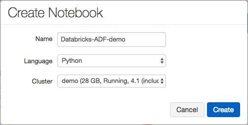

> **NOTE**: This notebook will be run by a call from Azure Data Factory, so when adding code based on the steps below, you should not be executing the cells. At this point, you are just setting the notebook up.

### Add configuration to the notebook

Now that you have a notebook, let's add some basic configuration cells to the notebook, so it is ready to work with our datasets.

1. In the first cell of the notebook, add the following code snippet to import the libraries that are needed for the actions to be performed in the notebook.

    ```python
    import datetime
    from pyspark.sql.types import *
    from pyspark.sql.functions import col, unix_timestamp
    ```

2. Next, hover your mouse over the first cell, and the select the **Insert new cell (+)** icon at the bottom center of the cell.

    

3. In the newly inserted cell, add the following code to create an [input widget](https://docs.azuredatabricks.net/user-guide/notebooks/widgets.html), which will allow you to pass a specific year into the notebook to restrict your dataset, if desired.

    ```python
    # Create a dropdown widget to allow the year to be passed in. Default value is "*", which will include all years possible in the dataset.
    dbutils.widgets.dropdown("year", "*", ["*", "1987", "1988", "1989", "1990", "1991", "1992", "1993", "1994", "1995", "1996", "1997", "1998", "1999", "2000", "2001", "2002", "2003", "2004", "2005", "2006", "2007", "2008"], "Year")
    ```

4. Finally, insert another new cell, and add the code below to write the value assigned to the `year` widget to a variable.

    ```python
    year = dbutils.widgets.get("year")
    ```

### Load airplane data from DBDS

In the step below, you will add code to cells to ingest the airplane data from a CSV file, and perform some data munging to clean up the dataset.

1. First, you will add code to specify the schema that should be used when importing the airplane data from its CSV file. Declaring a schema allows you to specify column names and datatypes, prior to loading the data into a [Spark DataFrame](https://docs.azuredatabricks.net/spark/latest/dataframes-datasets/introduction-to-dataframes-python.html). Add a new cell to the notebook, and add the following:

    ```python
    # Create schema for planes data
    planes_schema = StructType([
        StructField('TailNum', StringType(), False),
        StructField('Type', StringType()),
        StructField('Manufacturer', StringType()),
        StructField('IssueDate', StringType(), True),
        StructField('Model', StringType()),
        StructField('Status', StringType()),
        StructField('AircraftType', StringType()),
        StructField('EngineType', StringType()),
        StructField('YearBuilt', IntegerType())])
    ```

2. Next, read the `plane-data.csv` file into a DataFrame, specifying the schema declared above, along with telling the `spark.read.csv()` method that the file contains a header row. Insert a new cell, and add the following code:

    ```python
    # Read the planes CSV file into a DataFrame
    planes = spark.read.csv("/databricks-datasets/asa/planes/plane-data.csv",
        schema=planes_schema,
        header=True)
    ```

3. Now, you can add another new cell that will be used to get the data into the shape needed for the model being developed. This includes removing rows where there are null values, fixing instances where multiple versions of the manufacture's name are used, converting the IssueDate column to a unix_timestamp format, and dropping the Status column, which isn't needed for our model.

    ```python
    # Remove null rows
    planes = planes.filter((col("TailNum") != "null") & (col("Model") != "null") & (col("IssueDate") != "null"))

    # Clean up manufacturer names
    planes = planes.replace('MCDONNELL DOUGLAS AIRCRAFT CO', 'MCDONNELL DOUGLAS', 'Manufacturer')
    planes = planes.replace('MCDONNELL DOUGLAS CORPORATION', 'MCDONNELL DOUGLAS', 'Manufacturer')
    planes = planes.replace('AIRBUS INDUSTRIE', 'AIRBUS', 'Manufacturer')

    # Convert IssueDate to a timestamp type, and drop the Status column
    planes = planes.withColumn("IssueDate", unix_timestamp("IssueDate","M/d/yyyy").cast("timestamp")).drop("Status")
    ```

4. With the planes DataFrame now in desired shape, you can persist it to a Databricks [global table](https://docs.azuredatabricks.net/user-guide/tables.html) by adding the following code snippet to a new cell. Azure Databricks registers global tables to the Hive metastore, making them available across all clusters in your workspace.

    ```python
    planes.write.mode("overwrite").saveAsTable("planes")
    ```

### Load flight data from DBDS

Next, you will add code to ingest the fight data, and perform some data wrangling, similar to what you did above on the airplane data. The flight data includes multiple data files, one for each year, so the code below will make use of the `year` variable populated by the input widget. This code will allow you to request a single year, or pass in an asterisk (*) to retrieve all available years.

1. Insert a new cell into the notebook, and add the following code to read the `[Year].csv` file into a DataFrame. In this case, you will instruct the `spark.read.csv()` function to infer a schema based on the file contents, along with specifying that the file contains a header row.

    ```python
    # Read the flight CSV files into a DataFrame
    flights_dirty = spark.read.csv("/databricks-datasets/asa/airlines/" + year + ".csv",
        inferSchema=True,
        header=True)
    ```

2. Now, you insert a new cell to get the data into the shape needed for the model. This includes removing rows where TailNum values are set to 'NA' or 'UNKNOW', and fixing instances where data is set to 'NA' for various fields in the dataset.

    ```python
    # Remove rows where the TailNum value is 'NA' or 'UNKNOW'
    flights_dirty = flights_dirty.filter(flights_dirty.TailNum != 'NA').filter(flights_dirty.TailNum != 'UNKNOW')

    # Replace 'NA' values in the cancellation code with a blank value
    flights_dirty = flights_dirty.replace('NA', '', 'CancellationCode')

    # Replace 'NA' values in the delay fields with 0
    flights_dirty = flights_dirty.replace('NA', '0', 'ArrDelay')
    flights_dirty = flights_dirty.replace('NA', '0', 'DepDelay')
    flights_dirty = flights_dirty.replace('NA', '0', 'CarrierDelay')
    flights_dirty = flights_dirty.replace('NA', '0', 'LateAircraftDelay')
    ```

3. The next step is to reduce the DataFrame to just the columns desired for the model. Insert another cell, and add the following:

    ```python
    # Define a new DataFrame that includes just the columns being used by the model
    flights = flights_dirty.select('Year', 'Month', 'DayOfMonth', 'DayOfWeek', 'UniqueCarrier', 'FlightNum', 'TailNum', flights_dirty['ArrDelay'].cast('integer'), flights_dirty['DepDelay'].cast('integer'), 'Origin', 'Dest', flights_dirty['Cancelled'].cast('integer'), 'CancellationCode', flights_dirty['CarrierDelay'].cast('integer'), flights_dirty['LateAircraftDelay'].cast('integer'))
    ```

4. With the flights DataFrame now in desired shape, persist it to a Databricks global table by adding the following code snippet to a new cell.

    ```python
    flights.write.mode("append").saveAsTable("flights")
    ```

### Return a status from the notebook

The last cell in your notebook will return a JSON status message to ADF.

1. Add the following code to a new cell in your notebook:

    ```python
    import json
    dbutils.notebook.exit(json.dumps({
      "status": "OK",
      "message": "Cleaned data and created persistent tables",
      "tables": ["planes", "flights"]
    }))
    ```

> **NOTE**: A completed copy of the notebook can be found in this repo at [Databricks-ADF-demo.dbc](./notebooks/Databricks-ADF-demo.dbc) if needed for reference.

## Create Azure Data Factory pipeline

With your notebook now in place, you are ready to create the ADF pipeline that will call and run the notebook.

### Add Azure Databricks Linked Service

1. Navigate to your Data Factory in the [Azure portal](https://portal.azure.com), and select the **Author & Monitor** panel under Quick links. This will open a new Azure Data Factory tab in your browser.

    

2. On the **Let's get started** page, switch to the **Edit** tab by selecting the pencil icon on the left-hand menu.

    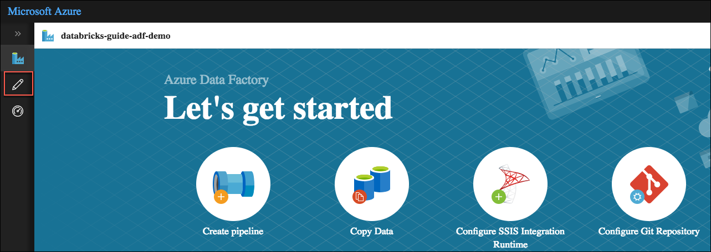

3. Select **Connections** at the bottom of the window, and then select **+ New**.

    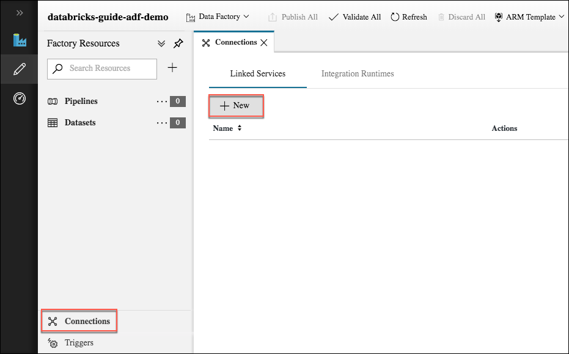

4. In the **New Linked Service** window, select the **Compute** tab, then on the compute tab select **Azure Databricks**, and then select **Continue**.

    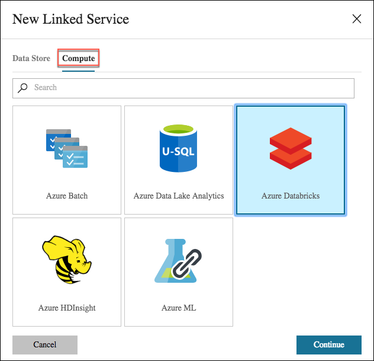

5. In the **New Linked Service** window, enter the following:
    - **Name**: Enter _AzureDatabricks_
    - **Select cluster**: Select _Existing cluster_
    - **Domain/Region**: Select the region where your Azure Databricks workspace is located
    - **Access Token**: Generate this from your Azure Databricks workspace, following these steps:
        - In your Azure Databricks workspace, select the **Account** icon in the top right corner, and then select **User Settings**.

            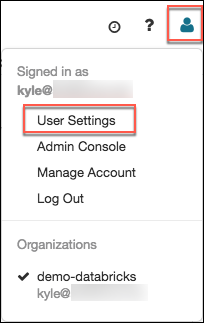

        - On the **User Settings** screen, select **Generate New Token**.

            

        - In the **Generate New Token** dialog, enter a comment, such as "ADF access," and then select **Generate**.

            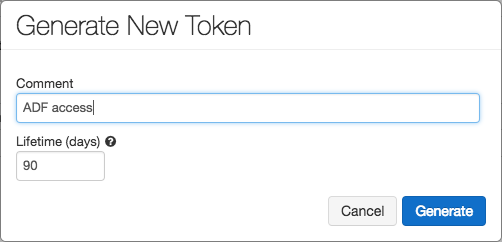

        - Copy the generated token and paste it into the Access Token field on the New Linked Service dialog in ADF. Once you've copied and pasted the token value, you can select Done on the Generate New Token dialog.

            

    - Select **Access token**, and paste the generated token into the **Access token** box.

    - Retrieve your cluster Id by following the steps below, and pasting it into the **Existing cluster id** box.

        - In your Cluster workspace, select **Clusters** from the left-hand menu, and then select your cluster from the list of available clusters.

            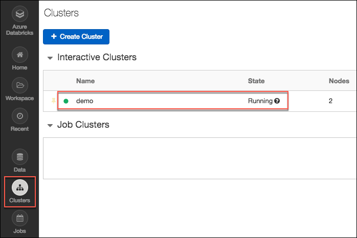

        - On the page for your cluster, select the Tags tab at the bottom, and copy your ClusterId.

        

    - Copy the Cluster Id value, and paste it into the Existing cluster id field on the New Linked Service dialog in ADF.

- The New Linked Service dialog should resemble the following. Select **Test connection** and ensure you get a **Connection successful** message, and then select **Finish** to save the Linked Service.

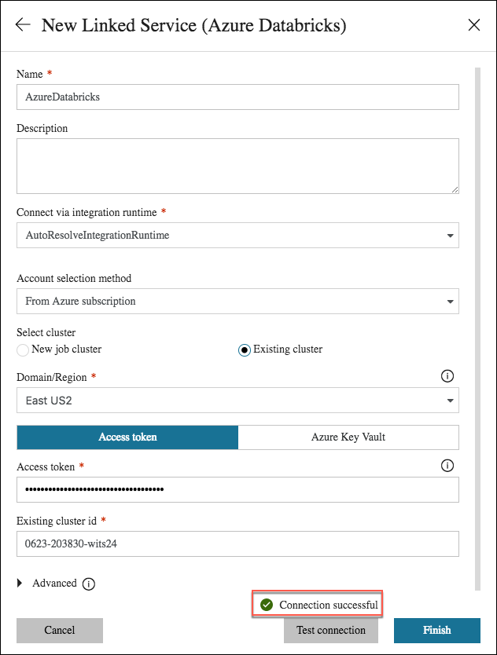

### Create a pipeline

1. In the ADF dialog, select the **plus (+)** icon under Factory Resources, and then select **Pipeline**.

    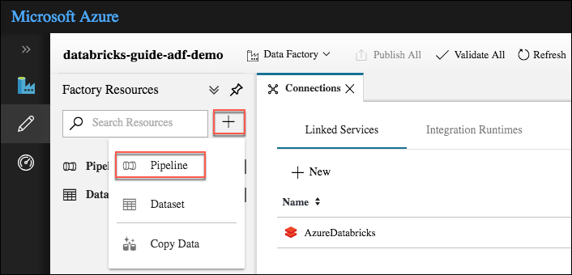

2. On the **General** tab of the pipeline properties, enter a name, such as _DatabricksPipeline_.

    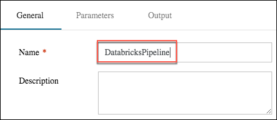

3. In the **Activities** toolbox, expand **Databricks** and drag the **Notebook** activity onto the pipeline design surface.

    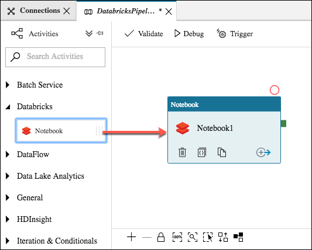

4. Enter a name, such as DemoNotebook, into the **General** properties tab for the Notebook activity.

    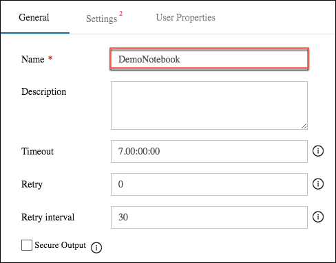

5. Select the **Settings** tab, and do the following:

    - **Linked service**: Select the _AzureDatabricks_ linked service you created previously

    - **Notebook path**: Enter the path to the notebook you created above. This will typically be in the format _/Users/[your@email.com]/[Notebook-name]_. For example, if you named your notebook Databricks-ADF-demo, and your Azure email account is user@microsoft.com, the path would be **/Users/user@microsoft.com/Databricks-ADF-demo**.

    - Expand **Base Parameters**, select **+ New**, enter **year** for the Name, and enter a four-digit year between 1987 and 2008, or enter "*" to include all years of flight data.

        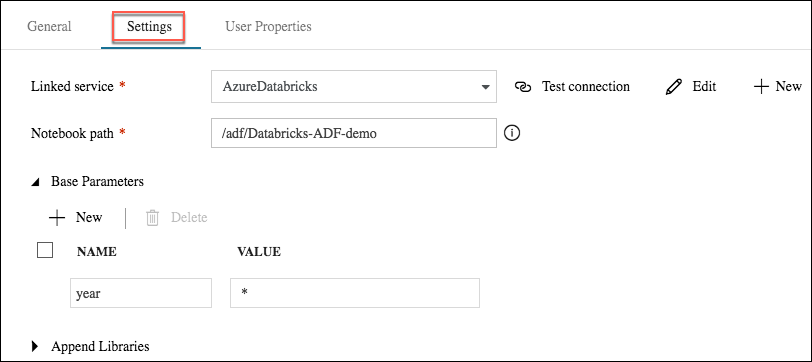

6. Next, validate the pipeline by selecting **Validate on the pipeline toolbar.

    

7. You should see a message that your pipeline has been validated, with no errors.

    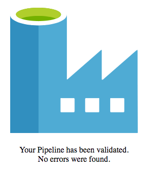

8. You can also view the underlying JSON code behind your pipeline by selecting the **Code** link at to top right of the pipeline tab.

    

9. The JSON should look something like the following:

    ```json
    {
        "name": "DatabricksPipeline",
        "properties": {
            "activities": [
                {
                    "name": "DemoNotebook",
                    "type": "DatabricksNotebook",
                    "policy": {
                        "timeout": "7.00:00:00",
                        "retry": 0,
                        "retryIntervalInSeconds": 30,
                        "secureOutput": false
                    },
                    "typeProperties": {
                        "notebookPath": "/Users/user@microsoft.net/Databricks-ADF-demo",
                        "baseParameters": {
                            "year": "*"
                        }
                    },
                    "linkedServiceName": {
                        "referenceName": "AzureDatabricks",
                        "type": "LinkedServiceReference"
                    }
                }
            ]
        }
    }
    ```

10. Now, publish the pipeline. Select **Publish All** in the ADF toolbar. The Data Factory UI will publishes your entities (linked services and pipeline) to the Azure Data Factory service.

    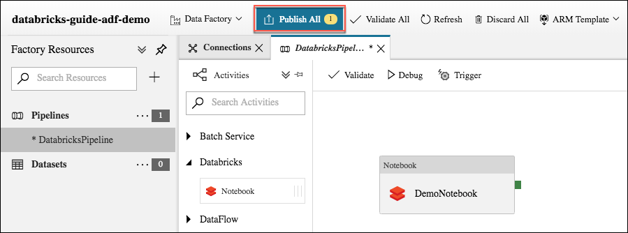

### Trigger the pipeline

To run your pipeline, it needs to be triggered. For this scenario, you will manually trigger the pipeline from the ADF UI. Usually, this would be handled via a one of two types of triggers:

- **Schedule trigger**: This trigger invokes pipeline execution on a time-based schedule.
- **Tumbling window trigger**: Fires at a periodic time interval from a specified start time, while retaining state. Tumbling windows are a series of fixed-size, non-overlapping, and continuous time intervals.
- **Event-based trigger**: Currently not supported in ADF.

> For more info on using triggers in your ADF pipelines, see [Pipeline execution and triggers in Azure Data Factory](https://docs.microsoft.com/azure/data-factory/concepts-pipeline-execution-triggers).

1. In the ADF window, select **Trigger** from the pipeline toolbar, and then select **Trigger Now**.

    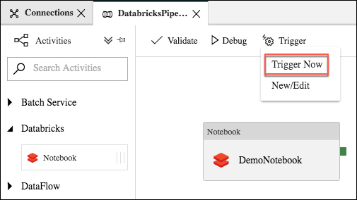

2. In the Pipeline Run dialog, select **Finish**.

### Monitor the pipeline

The pipeline Databricks Notebook activity will run the target notebook as a Job on your Azure Databricks cluster. You can monitor execution progress through the ADF UI, and when the job is complete, you can view the tables it created in your ADF workspace.

1. After starting your pipeline, you can monitor its progress by selecting the **Monitor** icon in the left-hand menu. On this screen, you will see the overall status of your pipeline. To see the details of individual activities, select the **View Activity Runs** icon under **Actions** for your pipeline.

    

    > NOTE: If your cluster is terminated, the Databricks Notebook activity within your pipeline will start the cluster, so it does not need to be running prior to starting your pipeline.

2. Once the pipeline completes, the status will switch to **Succeeded**. (You will need to hit refresh on the Monitor toolbar to update the status.) The time the pipeline takes to complete will depend on what you passed into the `year` parameter. If you requested all data (value of "*"), it can take up to 15 minutes to finish.

    

3. You can verify the table were created by the ADF Databricks Notebook activity by going into your Databricks workspace, and then selecting **Data** from the left-hand menu. This will bring up a list of tables in the workspace. There you should see `flights` and `planes` tables.

    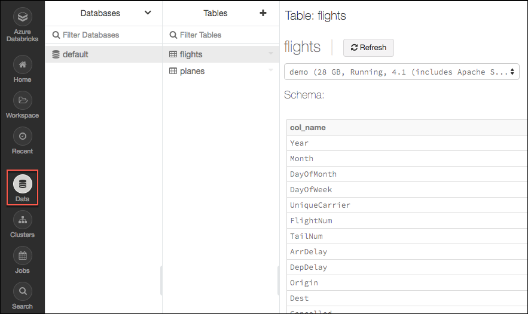

## Summary

In the scenario above, you created a simple ADF pipeline to execute a basic Databricks notebook. As you look to expand on this, some things consider are how you can use Databricks  notebooks to operationalize trained machine learning models, and using ADF pipelines to score newly received data on a scheduled basis. After scoring the data, you can many options, from writing it to Databricks tables and creating reports directly from your Databricks tables with Power BI, to advanced analytics with Azure SQL Data Warehouse.

Azure Data Factory provides a powerful tool for incorporating Azure Databricks into your advanced ETL/ELT activities.

### Next steps

Read next: [Apache Airflow](../automation-orchestration/apache-airflow.md)