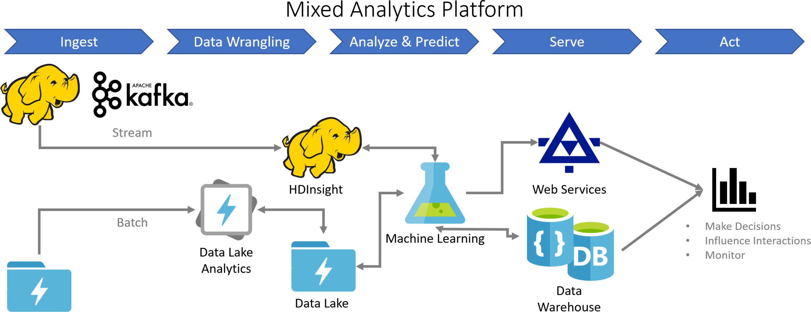
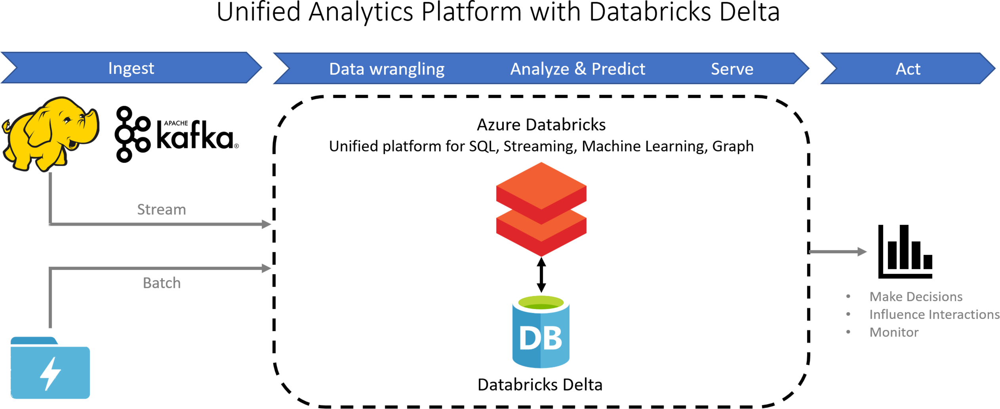

# Databricks Delta (private preview)

[Databricks Delta](https://docs.azuredatabricks.net/delta/index.html) is a transactional storage layer designed specifically to harness the power of Apache Spark and Databricks DBFS. In other words, it is a data management system built into Azure Databricks, providing a single analytics database within the same environment as the unified Spark platform. Delta brings data reliability and performance optimizations to cloud data lakes and reduces the complexity of managing Big Data infrastructure and application development. By unifying computational work and the database into a single SaaS platform, Delta enables fast predictive, real-time and ad-hoc queries to be performed at massive scale.

## Benefits of Delta

Azure Databricks and Databricks Delta is the first **unified** data management system that delivers:

- The scale and cost efficiency of data lake
- The ability to manage continuously changing data with the reliability and performance of data warehouse
- The low latency of streaming through indexing and caching

So, what does this mean for developers?

The unified platform means developers no longer need to move data between different analytics processes or storage engines. With Databricks Delta, all the compute and storage functions are performed is a single place, enabling queries to run faster, with lower-latency, while simultaneously processing more data over a fixed period of time.

### The problem with current architectures

Building end-to-end Big Data and machine learning pipelines has traditionally required organizations to mix and match various tools and services, including streaming systems, data lakes, and data warehouses. This architecture requires moving data from platform to platform so analytics processing can be performed by each tool in the pipeline, increasing latency, complexity and cost.



### Databricks Delta unified data management

With the unified platform of Azure Databricks and Databricks Delta the complexity of these pipelines is reduced dramatically. Different analytic computations work collaboratively on a single dataset without having to move it among ETL data transformations, streaming analytics, SQL queries and machine learning models, and the dataset stays in one database rather than moving from a data lake to a data warehouse to yet another database to inform decisions that require low latency.



## Databricks Delta tables

The core abstraction of Databricks Delta is a Databricks Delta table, which is an optimized Spark table that:

- Stores your data as Parquet files in DBFS
- Maintains a transaction log that efficiently tracks changes to the table

Databricks Delta requires Databricks Runtime 4.1 or above. Tables created using Databricks Runtime version lower than 4.1 must have their table protocol upgraded using the following:

```scala
%scala com.databricks.delta.Delta.upgradeTableProtocol("</path/to/table>" or "<tableName>")
```

You can read and write from Databricks Delta tables using the same Apache Spark SQL APIs that you are familiar with for reading and writing data from Hive tables and DBFS directories. With Delta, the transaction log and other enhancements provide the following additional functionality:

- **ACID (Atomicity, Consistency, Isolation, Durability) transactions**: Multiple writers can simultaneously modify a dataset and see consistent views
- **DELETES/UPDATES/UPSERTS**: Writers can modify a dataset without interfering with jobs reading the dataset
- **Automatic file management**: Data access speeds are improved by organizing data into large files that can be read efficiently
- **Statistics and data skipping** Read speeds are increased by 10-100x by tracking statistics about the data in each file and avoiding reading irrelevant information

### Create a Delta table

To demonstrate how to create a Databricks Delta table, we will use Spark SQL to query the `flights` table created in the [Azure Data Factory](../automation-orchestration/azure-data-factory.md#load-flight-data-from-dbfs) article, and write it to a Delta table using the following code. Note the `format` property is set to `delta` when saving the data to the Delta table.

```python
flights = spark.sql("SELECT * FROM flights")
flights.write.format("delta").save("/data/flights")
```

### Read from a Delta table

Use the `DataFrameReader` to read data a Delta table into a DataFrame:

```python
delta = spark.read.format("delta").load("/delta/flights")
display(delta)
```

The DataFrame returned automatically reads the most recent snapshot of the table for any query; you never need to run `REFRESH TABLE`. Databricks Delta automatically uses partitioning and statistics to read the minimum amount of data when there are applicable predicates in the query.

You can optionally specify partition columns when creating a new Databricks Delta table. Partitioning is used to speed up queries or DML that have predicates involving the partition columns. For example, we can partition by `UniqueCarrier` on the flight data:

```python
flights.write.format("delta").partitionBy("UniqueCarrier").save("/delta/events")
```

### Write to a Delta table

Use the `DataFrameWriter` to write data to a Delta table as an atomic operation. You must specify the `delta` format for write operations. If the table already exists, you must also specify `append` for the the `mode` property. Optionally, you can overwrite all the data in the table by setting the `mode` to `overwrite`.

```python
from pyspark.sql import Row

newRows = [
  Row(2018,12,11,3,"UA",115,"N999EV",0,0,"SFO","PPT",0,"null",0,0)
]

parallelizeRows = spark.sparkContext.parallelize(newRows)

# Create a new DataFrame
new_flights = spark.createDataFrame(parallelizeRows, delta.schema)

# Union the new DataFrame with the airport_code_location_lookup DataFrame
updated_flights = delta.union(new_flights)

updated_flights.write.format("delta").mode("append").save("/delta/flights")
```

Now, you can query the Delta table for just the newly inserted row:

```python
delta_updated = spark.read.format("delta").load("/delta/flights")
display(delta_updated.filter(delta_updated.Dest == 'PPT'))
```

### Update a Delta table

Using the `UPDATE` statement, you can apply expressions to change the value of columns, based on a row matching a predicate. For example, you can update the `Dest` value of all flights with a `FlightNum` of 115 and an `Origin` of SFO to be LAX using the following:

```sql
%sql
UPDATE flights SET Dest = 'LAX' WHERE FlightNum = 115 AND Origin = 'SFO'
```

Update operations automatically make use of the partitioning of the table when possible. This optimization means that it will be significantly faster to delete data based on partition predicates.

### Delete from a Delta table

The `DELETE` statement allows you to remove data from a Delta table that matches a specified predicate. For example:

```sql
%sql
DELETE FROM flights WHERE FlightNum = 115
```

Delete operations automatically make use of the partitioning of the table when possible. This optimization means that it will be significantly faster to delete data based on partition predicates.

## Use case

A common use case is to store both the intermediate and final results of a multi-stage pipeline in Databricks Delta. Typically these pipelines begin with relatively raw, unprocessed records and become more selective and refined as processing occurs.

In this scenario, raw data with very little transformation are ingested from many different parts of the organization. The data are then cleaned and normalized, sometimes joined with dimension information. Next, information is filtered down and aggregated, usually related to one particular business objective. Finally, high-level summary reports of key business metrics are generated.

Databricks Delta makes building and running this type of pipeline significantly easier, cheaper, and more effective by providing the following capabilities:

- **Retain large histories of data**: Databricks Delta can efficiently store years worth of data at any stage of the pipeline. Having a long history allows you to fix mistakes by reprocessing old data and also allows you to ask new questions about historical events.
- **Automatically update with streaming**: Streaming can efficiently read from one table and write the results to another, reducing the complexity and management overhead for each hop.
- **Query intermediate results**: Each step of the process is materialized as an actual table, and can optionally be optimized for fast read performance. If an ad-hoc query results in new insights, it can easily be turned into a materialized table by switching execution to streaming.
- **Share intermediate results**: When there are multiple downstream jobs that depend on a given computation, a Databricks Delta table is a natural forking point. Each downstream transformation can run against the efficiently columnar encoded table.
- **Backfill and correct with batch**: Databricks Delta supports a wide range of batch operations that you can use to backfill and correct mistakes transactionally without interrupting any new streaming data that is arriving.

## Getting started with Databricks Delta

Databricks Delta is currently in the private preview phase. This means that it is currently running in production, but some issues and use cases are still worked through to make the product ready for general availability. You can request access to the preview on the [Databricks Delta join the private preview page](https://databricks.com/product/databricks-delta).

## Next steps

Read next: [Automation and orchestration](../automation-orchestration/overview.md)