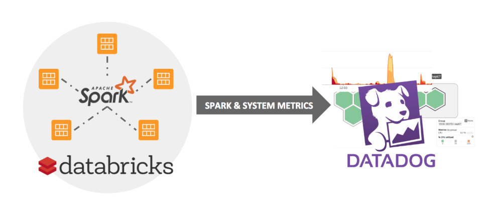

# Monitoring and Managing Azure DataBricks

## Metrics
Metrics help you monitor the performance of Azure Databricks clusters.

You can install [Datadog agents](https://www.datadoghq.com/) on you cluster nodes to send Datadog metrics to your Datadog account. This topic includes notebooks that install Datadog agents on Databricks clusters.

### Datadog Metrics
  
This is a walk-through which shows you two ways to set up Datadog monitoring in Databricks:

 - **Automated Datadog Monitoring:** [Import Notebook](https://docs.databricks.com/_static/notebooks/datadog-init-script.html) A one-click way to automate Datadog monitoring for all of your Databricks nodes and clusters. With just one command, you can configure Databricks to start a Datadog agent and stream both system and Spark metrics to your Datadog dashboard every time you launch a cluster.
 - **Datadog Setup Walkthrough:** [Import Notebook](https://docs.databricks.com/_static/notebooks/initialize-data-dog-agent.html) A step-by-step process for installing the Datadog agent on an existing Databricks cluster to start collecting Spark-specific metrics. You can follow along and import the notebook if you want to test this integration on one of your own clusters.

### Automated Datadog Monitoring

    

If you’re looking for a way to set up monitoring for your Databricks’ clusters as quickly as possible, our [Datadog Init Scripts](https://docs.databricks.com/_static/notebooks/datadog-init-script.html) are a great option. When you import and run the first notebook above, it will create one init script that automatically installs a Datadog agent on every machine you spin up in Databricks, and one init script that configures each cluster to send Spark metrics. To use this script, all you need to do is:

- Enter your own Datadog API key in the DD_API_KEY parameter (Line 4).
- Run the notebook once to save the init script as a global configuration.  

After you run the notebook, each new cluster will begin streaming metrics directly to your dashboards in Datadog.

### What Exactly Is the init Script Doing?
The first script, `datadogInstall.sh`, simply creates an agent on every machine in your cluster according to the Datadog installation instructions (see Step 1 in the Datadog Setup Walkthrough section below).

The second script configures your cluster to report Spark-specific metrics back to Datadog. For more detail on this configuration, read the next section.

### Datadog Setup Walkthrough

Now let’s walk through the setup step by step. You can follow along in [this notebook](https://docs.databricks.com/user-guide/faq/datadog.html#initialize-data-dog-agent). This can be used to set up a Datadog agent on an existing cluster.

 - **One-line Install**. Datadog makes it very simple — a one-line curl command, to be exact — to install an agent on your system. In this case, we’ll use the Ubuntu package install:  

        %sh DD_API_KEY=[ENTER_YOUR_API_KEY_HERE] bash -c "$(curl -L https://raw.githubusercontent.com/DataDog/datadog-agent/master/cmd/agent/install_script.sh)"  

    You’ll find the latest version of this command in your [Datadog Setup Guide](https://app.datadoghq.com/account/settings#agent/ubuntu).

    Note: Make sure you check the Datadog site for the latest install command and use the API key specified in your account.

- **Configure for Spark**. In order to start monitoring the Spark metrics on a cluster, a Spark config file must be written into the driver of the cluster. This config file requires the hostname and port of the driver so that the Datadog agent can point to it and listen for the Spark metrics. The hostname and port can be found in the master-params file as follows:  

        %sh cat /tmp/master-params
        10.0.177.85 44752  

These gets entered into the spark_url parameter of the config as shown below:

        %s echo "init_config:
        instances:
        - resourcemanager_uri: http://10.0.177.85:44752
        spark_cluster_mode: spark_standalone_mode
        cluster_name: 10.0.177.85" > /etc/datadog-agent/conf.d/spark.yaml  

 - **Restart Agent**. Once this config file is updated, the agent simply needs to be restarted in order to complete the Spark integration.  

        %sh sudo service datadog-agent restart  

 - **Check Connection**. A successful connection can be confirmed by calling the Datadog info command and looking for the following Spark check:  
 
        %sh sudo datadog-agent status
        spark (5.12.1:1.0.0)
        --------------------
        - instance #0 [OK]
        - Collected 25 metrics, 0 events & 2 service checks

 Init scripts allow you to execute shell scripts on both the drivers and workers. In general, the init scripts from the article above can be adapted and customized to install and connect your monitoring agent of choice.

### Additonal Links

- [Azure Databricks Metrics](https://docs.azuredatabricks.net/user-guide/clusters/metrics.html)