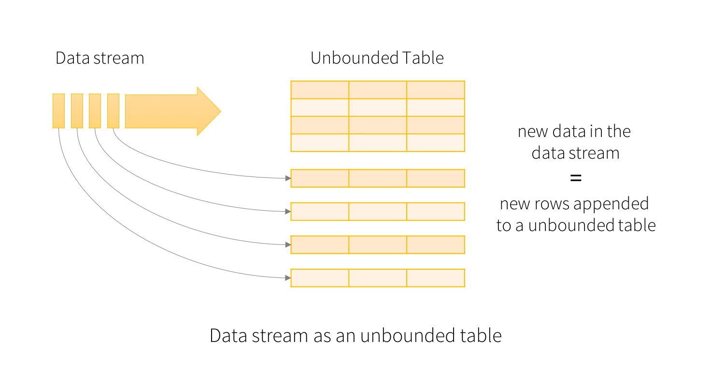
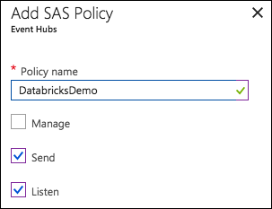
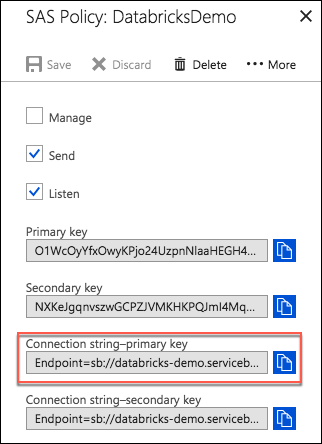
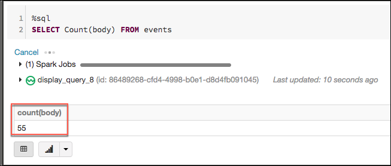
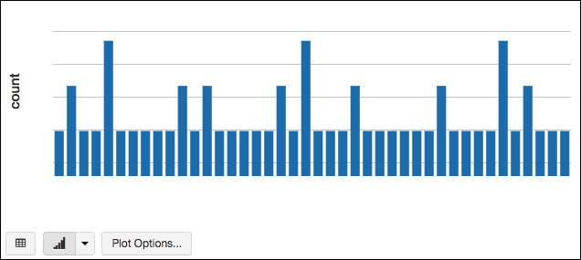

# Developing Spark Structured Streaming Apps

Many organizations benefit from collecting and analyzing massive amounts of data on customers, products, market trends, and other factors pertinent to their business. After-the-fact analysis of those data provides many benefits, but as more companies begin to take advantage of Big Data analytics, competitive factors are driving many organizations to seek actionable insights in near-real-time to stay ahead. The ability to react instantly to customer actions or changing market conditions can result in greatly improved business outcomes. Imagine, for example, the ability to steam weblogs through a machine learning model to generate product recommendations for users based on their demographic profile and past purchase history, and then being able to display those targeted recommendations back to the user, in near-real-time, while they are actively browsing your site.

[Structured Streaming](https://docs.azuredatabricks.net/spark/latest/structured-streaming/index.html) on Azure Databricks provides the ability to do just that. Structured Streaming is a scalable and fault-tolerant stream processing engine built on the Spark SQL engine. It leverages the Apache Spark API that lets you process streaming data in the same manner you process static data. The Spark SQL engine performs computations on the streaming data incrementally and continuously updates the result as new data arrives.

## Structured Streaming queries

Structured Streaming treats all the data arriving as an unbounded input table, with each new item in the stream treated like a row appended to the input table.



You, as the developer, can then defines a query on this input table, as if it were a static table. The results of your computations will be written to an output sink. Spark automatically converts this batch-like query to a streaming execution plan. Triggers can be used to control when to update the results. Each time a trigger fires, Spark checks for new data (new row in the input table), and incrementally updates the result.

For a deeper explanation into how Structured Streaming works, and detailed programming guidance see the [Apache Spark Structured Streaming Programming Guide](http://spark.apache.org/docs/latest/structured-streaming-programming-guide.html).

### Creating streaming DataFrames and streaming Datasets

Streaming DataFrames can be created through the `DataStreamReader` interface returned by `SparkSession.readStream()` Just as with the `read` method for creating static DataFrames from files, such as CSV or TXT, the details of the source, such as format, schema, and options, can be specified inline.

```python
# Create DataFrame representing the stream of input lines from connection to localhost:9999
lines = spark \
    .readStream \
    .format("socket") \
    .option("host", "localhost") \
    .option("port", 9999) \
    .load()

# Split the lines into words
words = lines.select(
   explode(
       split(lines.value, " ")
   ).alias("word")
)

# Generate running word count
wordCounts = words.groupBy("word").count()
```

To determine if a DataFrame is a streaming DataFrame, you can use the `isstreaming` property. This will return true or false.

```python
df.isStreaming
```

#### Input sources and Output sinks

Details about the built in input sources can be found in the [Structured Streaming Programming Guide](http://spark.apache.org/docs/latest/structured-streaming-programming-guide.html#input-sources).

Additional sources we will discuss in this article are:

- **Kafka source** - Reads data from Kafka. It’s compatible with Kafka broker versions 0.10.0 or higher. See the Kafka Integration Guide for more details.
- **Event Hubs source** - Reads data from Azure Event Hubs.

It is important to note that some input sources and output sinks, such as "socket", "memory", and "console" are designed for testing only, and should not be used in production environments.

## Azure Event Hubs

[Azure Event Hubs](https://azure.microsoft.com/en-us/services/event-hubs/) is a hyper-scale telemetry ingestion service that collects, transforms, and stores millions of events. As a distributed streaming platform, it gives you low latency and configurable time retention, which enables you to ingress massive amounts of telemetry into the cloud and read the data from multiple applications using publish-subscribe semantics.

Below, we provide a step-by-step example of how to stream events from Azure Event Hubs using  Structured Streaming in Azure Databricks.

### Prerequisites

Before beginning, make sure you have completed the following:

1. Create an Azure Databricks workspace, and add a cluster running Databricks Runtime 3.5 or higher
2. Add the Azure Event Hubs Spark Connector to your Databricks workspace
    - [Create a library](https://docs.azuredatabricks.net/user-guide/libraries.html#maven-libraries) in your Databricks workspace using the Maven coordinate `com.microsoft.azure:azure-eventhubs-spark_2.11:2.3.1`.
    - [Attach the created library](https://docs.azuredatabricks.net/user-guide/libraries.html#attach-libraries) to your Databricks cluster.
3. Create an Event Hubs Namespace in your Azure subscription
4. Create an Event Hub within the namespace named **databricks-demo**

### Connect to Event Hubs

In order to reach Event Hubs, you will need to obtain the connection string for the **databricks-demo** Event Hub from the [Azure portal](https://portal.azure.com).

1. On the Event Hubs Namespace blade, select **Event Hubs** from the left-hand menu, select the **databricks-demo** Event Hub from the list.

2. Select **Shared access policies** on the **databricks-demo** blade.

3. On the Shared access policies blade that appears, select **+ Add**, then add a SAS Policy named **DatabricksDemo** with Send and Listen access, and select **Create**.

    

4. Now, select the newly created DatabricksDemo SAS Policy from the list, and copy the **Connection string-primary key** value.

    

5. Next, open your Azure Databricks workspace, create a new notebook, and attach it to your cluster.

6. First you need to import some support modules that will help in creating a DataFrame that has the schema expected by Event Hubs. In the new notebook, add the following into the first cell.

    ```python
    from pyspark.sql.types import StructField, StructType, StringType, Row
    import json
    ```

7. Insert a new cell and add the following code to create Event Hubs configuration dictionary, replacing `<your-event-hubs-connection-string>` with the value you copied from the DatabricksDemo SAS Policy. The `eventHubs.startingPosition` parameter tells Event Hubs where to start reading from in the Event Hubs events (setting this to -1 tells it to start from the beginning of the event stream). See this [document](https://github.com/Azure/azure-event-hubs-spark/blob/master/docs/PySpark/structured-streaming-pyspark.md) for more details on the configuration options.

    ```python
    # Set Event Hub configuration dictionary
    eventHubsConfig = {
      'eventhubs.connectionString' : "<your-event-hubs-connection-string>",
      'eventhubs.startingPosition' : json.dumps({"offset":"-1", "seqNo":-1,"enqueuedTime": None,"isInclusive": True})
    }
    ```

8. In a new cell, add the following code to create a schema definition representing the structure expected by Event Hubs.

    ```python
    eventHubsSchema = StructType([
      StructField("body",StringType(), False),
      StructField("partitionId",StringType(), True),
      StructField("partitionKey",StringType(), True),
    ])
    ```

9. The next thing you will do is use Azure Databricks to send a few events to your Event Hub, so you have data to read from your streaming query. Insert a new cell, and add the following. This code adds new rows to a DataFrame.

    ```python
    checkpointLocation = "///checkpoint.txt"

    # Add rows to send to Event Hub
    newRows = [
      Row("This is new message #1!", None, None),
      Row("This is new message #2!", None, None),
      Row("This is new message #3!", None, None),
      Row("This is new message #4!", None, None),
      Row("This is new message #5!", None, None)
    ]
    parallelizeRows = spark.sparkContext.parallelize(newRows)
    new_messages = spark.createDataFrame(parallelizeRows, event_hubs_schema)
    ```

10. Now, insert another cell, and add the code to send the rows created above into your configured Event Hub instance. NOTE: You will rerun this cell multiple times as you proceed to add new events into Event Hubs, and observe the results.

    ```python
    # Write body data from a DataFrame to EventHubs. Events are distributed across partitions using round-robin model.
    ds = new_messages \
      .select("body") \
      .write \
      .format("eventhubs") \
      .options(**ehWriteConf) \
      .option("checkpointLocation", checkpointLocation) \
      .save()
    ```

11. You are now ready to set up a Structured Streaming query, which will be represented by a DataFrame, and read events from Event Hubs. In a new cell, add the following, which effectively starts a process to listen for new events, starting from the beginning of the Event Hubs events.

    ```python
    streaming_df = spark \
      .readStream \
      .format("eventhubs") \
      .options(**eventHubsConfig) \
      .load()
    ```

12. You may notice that even though the streaming query is running, you aren't seeing any output. To view the streaming output, you can simply pass the streaming DataFrame to the `display` method, using the the following code:

    ```python
    display(streaming_df.withColumn("body", streaming_df["body"].cast("string")))
    ```

    > **NOTE**: The `body` from Event Hubs is always provided as a byte array, so you will use `cast("string")` to explicitly deserialize the body column for readable output.

13. You should see the five rows you added appear in the results pane. Now, go back and rerun the cell containing `ds = new_messages...` to add more events into Event Hubs, and observe that the streaming query results will update automatically as the new events are received by Event Hubs:

    

14. Now, register the streaming DataFrame as a temporary view, which will enable you to query the streaming using SQL! Add the following code into two new cells.

    ```python
    streaming_df.withColumn("body", streaming_df["body"].cast("string")).createOrReplaceTempView("events")
    ```

    ```sql
    %sql
    SELECT Count(body) FROM events
    ```

15. You will see a count of the number of events displayed. Rerun the query above to add more events to Event Hubs, and observe that the row count will update automatically.

    

16. Finally, use SQL to query the enqueuedTime, and then use the built-in notebook visualizations to produce a bar chart with the count of events that were enqueued at the same time (horizontal axis is enqueuedTime and the vertical axis is the count).

    ```sql
    %sql
    SELECT 1 as count, enqueuedTime FROM events
    ```

    

17. You can stop the streaming query by selecting **Stop Execution** on the notebook toolbar.

## Kafka on HDInsight

[Apache Kafka](https://kafka.apache.org/intro) is a distributed streaming platform, providing the ability to publish and subscribe to streams of records, similar to a message queue or enterprise messaging system. Apache Kafka on HDInsight provides this as a managed high-throughput, low-latency service for real-time data.

### Connect to Kafka on HDInsight

To connect to Kafka on HDInsight with Azure Databricks, do the following:

> The Apache Kafka connectors for Structured Streaming are packaged in Databricks Runtime. You use the `kafka` connector to connect to Kafka 0.10+ and the `kafka08` connector to connect to Kafka 0.8+.

1. Create an HDInsight Kafka cluster, and [configure your Azure Virtual Network](https://docs.microsoft.com/en-us/azure/hdinsight/kafka/apache-kafka-connect-vpn-gateway).

2. Configure the Kafka brokers to [advertise the correct address for IP advertising](https://docs.microsoft.com/en-us/azure/hdinsight/kafka/apache-kafka-connect-vpn-gateway#configure-kafka-for-ip-advertising).

3. Peer the Kafka cluster to the Azure Databricks cluster, using the instructions provided in [Virtual Network Peering](https://docs.azuredatabricks.net/administration-guide/cloud-configurations/azure/vnet-peering.html#vnet-peering).

4. You need to obtain two pieces of information from your Kafka cluster prior to connecting to it from your notebook:

    - List of Kafka brokers
    - List of topics from Kafka

5. Once your Kafka connection is established, you can create a streaming DataFrame in your Azure Databricks notebook, similar to how it was done with Azure Event Hubs, but using the `kafka` format. In the options, you need to specify a comma-delimited list of your Kafka brokers.

    ```python
    # Setup connection to Kafka
    query = spark \
        .readStream \
        .format("kafka") \
        .option("kafka.bootstrap.servers", "host1:port1,host2:port2") \
        .option("subscribe", "topic1,topic2") \
        .option("startingOffsets", "latest") \
        .load()
    ```

    > The Azure Databricks documentation provides a subset of [configuration settings for connecting to Kafka](https://docs.azuredatabricks.net/spark/latest/structured-streaming/kafka.html#configuration).

6. To read the data from the stream, use a query like the following:

    ```python
    df.selectExpr("CAST(key AS STRING)", "CAST(value AS STRING)")
    ```

    > **NOTE**: The `key` and the `value` from Kafka are always provided as byte arrays, so you will use `cast(x AS STRING)` to explicitly deserialize the keys and values.

Important things to note around Kafka parameters:

You should _not_ set the following Kafka parameters for the Kafka 0.10 connector as it will throw an exception:

- `group.id`: Setting this parameter is not allowed for Spark versions below 2.2.
- `auto.offset.reset`: Instead, set the source option `startingOffsets` to specify where to start. To maintain consistency, Structured Streaming (as opposed to the Kafka Consumer) manages the consumption of offsets internally. This ensures that you don’t miss any data after dynamically subscribing to new topics/partitions. `startingOffsets` applies only when you start a new Streaming query, and that resuming from a checkpoint always picks up from where the query left off.
- `key.deserializer`: Keys are always deserialized as byte arrays with `ByteArrayDeserializer`. Use DataFrame operations to explicitly deserialize the keys.
- `value.deserializer`: Values are always deserialized as byte arrays with `ByteArrayDeserializer`. Use DataFrame operations to explicitly deserialize the values.
- `enable.auto.commit`: Setting this parameter is not allowed. Spark keeps track of Kafka offsets internally and doesn’t commit any offset.
- `interceptor.classes`: Kafka source always read keys and values as byte arrays. It’s not safe to use `ConsumerInterceptor` as it may break the query.

### Using SSL

Using SSL with Kafka connections requires additional configuration, instructions for which can be found in the Confluent documentation [Encryption and Authentication with SSL](https://docs.confluent.io/current/kafka/authentication_ssl.html#clients). You can provide the configurations described there, prefixed with `kafka`., as options. It is recommended that certificates are stored in Azure Blob storage and accessed through a DBFS mount point. Combined with Cluster and Job ACLs, you can restrict access to the certificates only to clusters that can access Kafka.

Once these paths are mounted, you can use the DBFS path to the certificates in your options. For example:

```python
df = spark.readStream \
          .format("kafka") \
          .option("kafka.bootstrap.servers", ...) \
          .option("kafka.ssl.truststore.location", "/mnt/kafka-private/ssl/kafka.client.truststore.jks") \
          .option("kafka.ssl.keystore.location", "/mnt/kafka-private/ssl/kafka.client.keystore.jks") \
          ...
```

## Structured Streaming in Production

When running notebooks containing streaming queries in a production environment, you are likely to want resiliency and uptime guarantees. This can be accomplished by running your notebooks with [Azure Databricks Jobs](../jobs/jobs-overview.md).

### Failure recovery

Production-grade streaming applications require robust failure handling. In Structured Streaming, enabling checkpointing for a streaming query allows you to restart the query after a failure, and continue the query from where the failed one left off. This provides fault tolerance and data consistency guarantees.

#### Query fault tolerance

To make your queries fault tolerant, you must enable query checkpointing and configure Databricks jobs to restart your queries automatically after a failure. To enable checkpointing, set the `checkpointLocation` option to a location in DBFS or cloud storage on your query prior to starting the query, as follows:

```python
streamingDataFrame.writeStream
  .format("parquet")
  .option("path", "dbfs://outputPath/")
  .option("checkpointLocation", "dbfs://checkpointPath")
  .start()
```

This checkpoint location preserves all of the essential information that uniquely identifies a query, so every query must have a unique checkpoint location.

#### Restarting jobs

When creating the Databricks job with the notebook or JAR that has your streaming queries, be sure to configure it to:

- Always use a new cluster.
- Always retry on failure.

Jobs have tight integration with Structured Streaming APIs and can monitor all streaming queries active in a run. This configuration ensures that if any part of the query fails, jobs automatically terminate the run (along all the other queries) and start a new run in a new cluster. The new run re-executes the notebook or JAR code and restarts all of the queries again. This is the safest way to ensure that you get back into a good state.

## Additional resources

- [Structured Streaming In Apache Spark](https://databricks.com/blog/2016/07/28/structured-streaming-in-apache-spark.html)
- [Tutorial: Stream data into Azure Databricks using Event Hubs](https://docs.microsoft.com/en-us/azure/azure-databricks/databricks-stream-from-eventhubs)